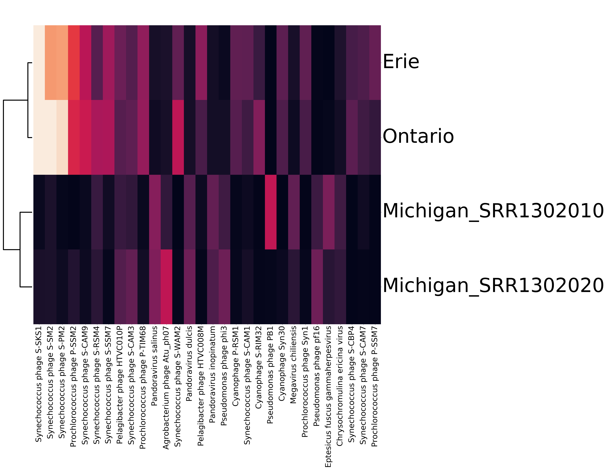

# Useful scripts for bioinformatics purposes

## dendrogram.py

Script for building a dendrogram for environmental metagenomic samples based on their taxonomic composition.

1. Perform taxonomic annotation of each sample with [Centrifuge](https://github.com/infphilo/centrifuge)
2. Run ``centrifuge-kreport`` to get output taxonomy in [kraken-format](https://github.com/DerrickWood/kraken2/blob/master/docs/MANUAL.markdown#sample-report-output-format)
3. Run dendrogram.py to build image with dendrogram
```
python3 dendrogram.py [-c COUNT] [-o OUTPUT] (-s N [N ...] | -t table)
```
```-c COUNT``` — Number of most abundant taxons to use (default: all). Names will be shown if count <= 50

```-o OUTPUT``` — File to save dendrogram to (default: dendrogam.png)

```-s N [N ...]``` — files with taxonomy of samples from step 2

``` -t table``` — one tabular file with taxonomy of samples


It is recommended to set ```c``` parameter less than 100 for better visualisation.

Example of dendrogram of viral communities from various lakes:



## Contact

Developed by Artem Ivanov at Computer Technologies Lab, ITMO University, Saint-Petersburg, Russia

Should you have any problems or feedback, please send them to abivanov@itmo.ru
